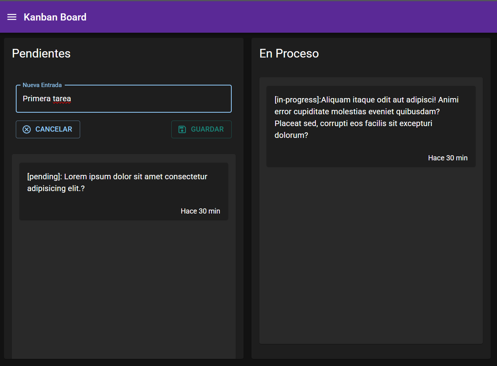
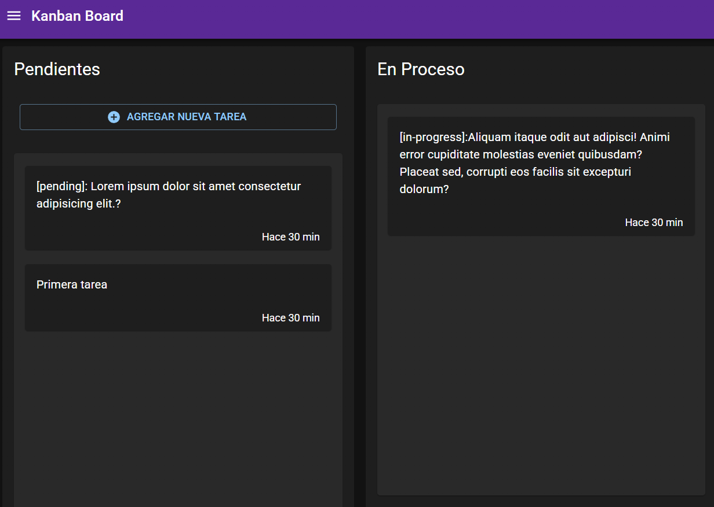

<!--  -->

&nbsp;

&nbsp;

# Aplicación Next.Js - Kanban Board

Creacion de proyecto de sobre administracion de tareas en un tablero **KANBAN** con uso de API interna y trabajo `getServerSideProps`, en el cual se ponen en practica tecnicas de construccion de renderizado dinamico del lado del servidor como: `Server Side Rendering (SSR)`.  Asi como tambien se pusieron en practica los siguientes principios:

Elaborado en Next.Js `v12.3.4`, React `v17.0.2`, Material UI `v5.4.0`.

**Kanban Dashboard Task**
[DEMO](https://)

&nbsp;

## Screenshots del proyecto

## Descripción del proyecto

&nbsp;

**1) Propiedades y funciones de Next,js**
   - Control general del documento mendiante el archivo `_document.tsx` con la propiedad `DocumentContext`

   - Ejecucion del lado del servidor `getStaticProps` ,`getStaticPaths`,

   - Uso de propiedades de componentes `FC`, `<NextPage>`, `<Image>`, `<Html>`, `<Head>`, `<Main>`, `<NextScript>`

  - Creacion de paginas dinamicas `[id]`

  - Uso de variables de entorno `.env`
    
  - Manejo de tipado `interface`, `type`
  
  - Uso de Drag and Drop en los cards

&nbsp; 

**2) Propiedades y funciones de React JS**
- Propiedades de React JS: `useEffect`,  `useState`, `useRouter`.

&nbsp; 

**3) Actividades y acciones atraves de API**
- Manejo de libreria de conexion API con `axios`
  
- Creacion de CRUD con `API Rest Full` de Next.js

&nbsp; 

**4) Librerias externas y de componentes**

- Uso de librerias externas `canvas-confetti`

- Uso de componentes Next/UI `<Row>`, `<Text>`, `<Image>`, `<Button>`, `<Container>`, `<Spacer>`, `<Link>`, `<Card>, <Card.Body>, <Card.Header>`, `<Grid>`, `<createTheme>`

- Uso de `drag and drop`

&nbsp; 

&nbsp; 

## Como levantar proyecto
---

    npm run dev    (modo desarrollo)
    npm run start  (despues de hacer build)

&nbsp; 

## Exportar proyecto - Build
---

Ejecute el comando `npm run build` para exportar el proyecto. Al exportar el proyecto se almacenarán en el directorio `.next`.

    npm run build

- Libreria Materia UI
- Seleccion y configuracion de Lightheme y DarkTheme
- Manejo de estados y comunicacion entre componentes con `Context`, `Provider` y `Reducer`
- Creacion de snippets de Context, Provider, Reducer
- Uso de `useState`, `useContext`, `useReducer`, `createContext`, `useMemo` de RectJS
- Persistencia en BD Mongo  
- LLamado a API propio
- Creacion de layout con toggle menu
- Instlacion de libreria externa `UUID`
- Uso de formularios 
- Configuracion y crecion de BD en Docker de forma local
- 

npm i react-beautiful-dnd

